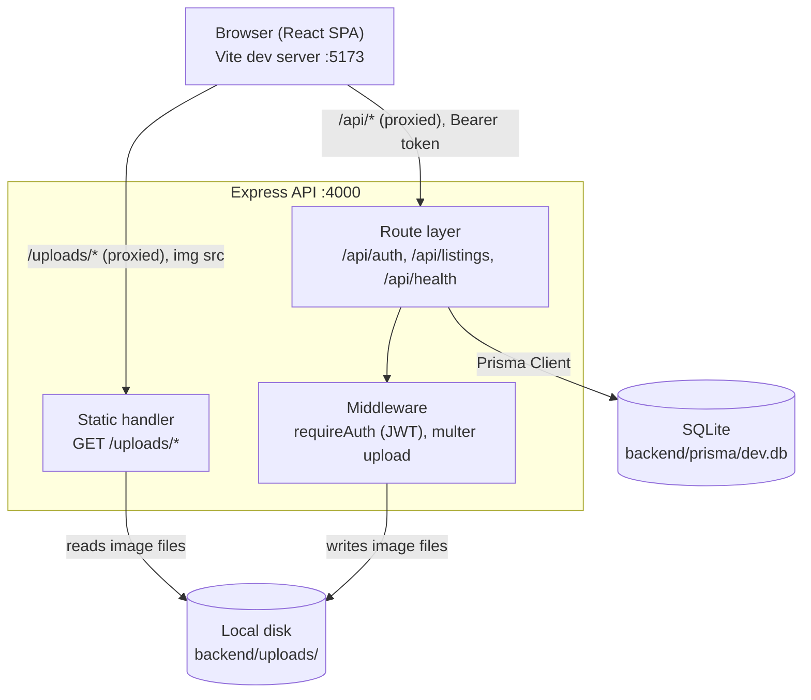
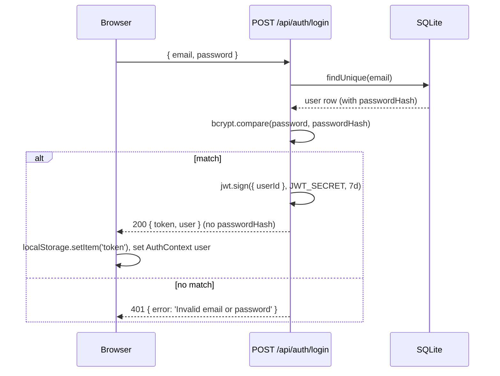
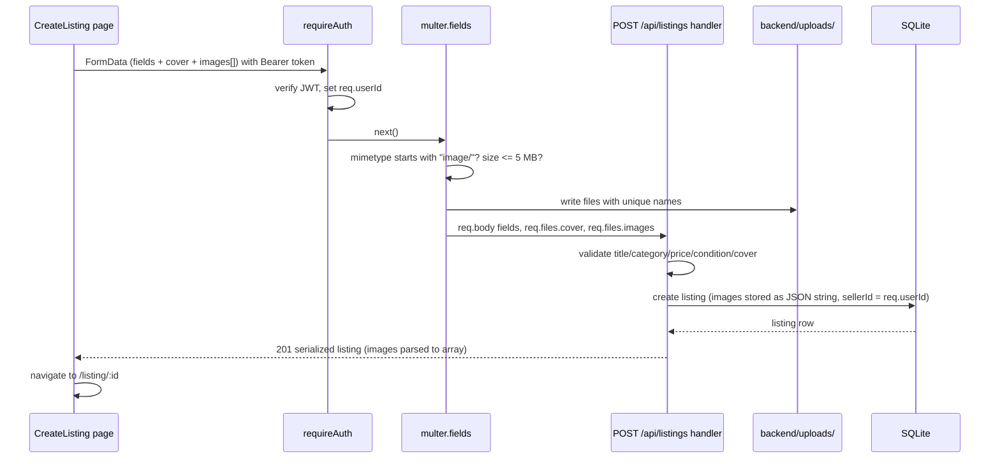

# Design Document

## Overview

CampusKart is a two-part web application in a single repository: an Express REST API
(`backend/`) and a React single-page application (`frontend/`). The API owns persistence,
authentication, image storage, and all listing queries. The SPA owns rendering, routing, and
client-side session state. The two communicate over JSON, plus `multipart/form-data` for the
one endpoint that accepts images.

The MVP is deliberately small. It runs on one developer's laptop with two `npm run dev`
processes and a SQLite file, has no build-time infrastructure, and needs no cloud account.
Every technology choice below optimizes for "one person can finish and demo this," with
migration paths noted where a future release would outgrow the choice.

Scope is limited to the nine requirements in `requirements.md`: registration, login, access
control, listing creation with images, the feed, search and filtering, listing detail with
contact links, managing and removing one's own listings, and responsive layout. Items listed
under Known Limitations in the requirements (wanted posts, favorites, alerts, admin panel,
ratings, payments, monetization, multi-college, in-app chat) are absent from this design by
intent, not by omission.

## Architecture

### System shape



In development, the Vite dev server proxies both `/api` and `/uploads` to
`http://localhost:4000`. The browser therefore only ever talks to `localhost:5173`, which
removes CORS from the picture entirely and lets the frontend use relative URLs
(`/api/listings`, `/uploads/abc.jpg`) that keep working unchanged if the SPA is later served
from the same origin as the API.

### Repository layout

```
campuskart/
├── README.md                  # setup, run, known limitations
├── backend/
│   ├── .env                   # DATABASE_URL, JWT_SECRET, PORT
│   ├── .gitignore
│   ├── package.json
│   ├── prisma/
│   │   └── schema.prisma
│   ├── uploads/               # multer destination, git-ignored
│   └── src/
│       ├── index.js           # express app, static /uploads, route mounting, listen
│       ├── prisma.js          # single PrismaClient instance
│       ├── constants.js       # CATEGORIES, CONDITIONS
│       ├── middleware/
│       │   ├── auth.js        # requireAuth
│       │   └── upload.js      # multer storage, filter, limits
│       └── routes/
│           ├── auth.js        # signup, login, me
│           └── listings.js    # create, feed, mine, detail, remove
└── frontend/
    ├── .gitignore
    ├── package.json
    ├── vite.config.js         # Tailwind plugin + /api and /uploads proxy
    ├── index.html
    └── src/
        ├── main.jsx           # Router + AuthProvider mount
        ├── App.jsx            # route table
        ├── index.css          # Tailwind directives
        ├── api.js             # axios instance + token interceptor
        ├── constants.js       # CATEGORIES, CONDITIONS, timeAgo()
        ├── context/AuthContext.jsx
        ├── components/
        │   ├── Navbar.jsx
        │   ├── ListingCard.jsx
        │   └── ProtectedRoute.jsx
        └── pages/
            ├── Home.jsx
            ├── Login.jsx
            ├── Signup.jsx
            ├── CreateListing.jsx
            ├── ListingDetail.jsx
            └── MyListings.jsx
```

### Technology decisions

| Concern | Decision | Rationale |
| --- | --- | --- |
| API | Node.js + Express | Smallest amount of ceremony for a handful of REST routes; same language as the frontend. |
| ORM / DB | Prisma + SQLite | Zero-install database in a single file. The schema, migrations, and typed client come free. Switching to Postgres later is a one-line change to the `datasource` block plus a new `DATABASE_URL`. |
| UI | React + Vite + Tailwind CSS | Vite gives instant dev startup and the proxy used above. Tailwind keeps styling in the markup, so there is no parallel CSS architecture to maintain. |
| Auth | JWT (7-day expiry) + bcrypt | Stateless, so no session store. A 7-day token means the demo account stays logged in across a review session. |
| Token storage | `localStorage` | Survives reload and is readable by the axios interceptor. The tradeoff (XSS exposure, versus an `httpOnly` cookie) is accepted for the MVP and recorded in Known Limitations. |
| Images | multer to `backend/uploads/`, served at `/uploads` | No S3 account, no signed URLs, no bill. Cloud object storage is future work. |
| Platform | Responsive web only | One codebase serves phone and laptop. No native mobile app (Requirement 9). |

### Request flows

Signup and login both end with the SPA holding a token and a user object:



Creating a listing is the only multipart flow:



## Components and Interfaces

### Backend: application skeleton (`src/index.js`)

Loads `.env` via `dotenv`, creates the Express app, and wires, in order:
`express.json()` for JSON bodies, `express.static` for `/uploads`, the `/api/health` route,
`/api/auth`, `/api/listings`, and finally a JSON error handler. Listens on `process.env.PORT`
(4000). Creating the `uploads/` directory on boot if it is missing keeps a fresh clone from
failing on the first upload.

### Backend: `requireAuth` middleware (`src/middleware/auth.js`)

Reads the `Authorization` header, expects the `Bearer <token>` form, verifies the token with
`JWT_SECRET`, and assigns `req.userId` from the payload. A missing, malformed, or expired
token produces `401 { error }` and the handler never runs. This middleware is attached only to
write routes plus `GET /api/auth/me` and `GET /api/listings/mine`; the feed and detail routes
are public (Requirements 2.3, 2.4, 3.1, 3.3, 3.4).

### Backend: upload middleware (`src/middleware/upload.js`)

`multer.diskStorage` writes into `backend/uploads/` with a collision-proof filename
(timestamp + random suffix + original extension). A `fileFilter` rejects anything whose
mimetype does not start with `image/`, and `limits: { fileSize: 5 * 1024 * 1024 }` caps each
file at 5 MB (Requirements 4.9, 4.10). The create route uses:

```js
upload.fields([
  { name: 'cover',  maxCount: 1 },
  { name: 'images', maxCount: 4 },
])
```

so multer itself enforces "exactly one cover, at most four extras" at the transport level
(Requirements 4.2, 4.3).

### Backend: REST API

All responses are JSON. Errors use a single shape, `{ error: "human readable message" }`.

| Method & path | Auth | Body / query | Success | Notes |
| --- | --- | --- | --- | --- |
| `POST /api/auth/signup` | no | JSON: `name, email, password, hostel, phone`, optional `avatarUrl` | `201 { token, user }` | Validates presence of each required field and email syntax; hashes with bcrypt; sets `verified: true`. Returns `409` if the email exists. Never returns `passwordHash` (Requirements 1.1–1.9). |
| `POST /api/auth/login` | no | JSON: `email, password` | `200 { token, user }` | Same `401` message for unknown email and wrong password (Requirements 2.1, 2.2). |
| `GET /api/auth/me` | yes | – | `200 { user }` | Used by AuthContext to restore a session on page load (Requirement 2.3). |
| `GET /api/listings` | no | `q, category, condition, minPrice, maxPrice` | `200 [listing]` | Active only, newest first. Seller shape is `{ id, name, hostel, verified }` — **no phone** (Requirements 5.1–5.5, 6.1–6.8). |
| `GET /api/listings/mine` | yes | – | `200 [listing]` | The caller's active listings, newest first. **Must be declared before `/:id`** or Express matches `mine` as an id (Requirement 8.1). |
| `POST /api/listings` | yes | multipart: `title, description, category, price, negotiable, condition` + files `cover` (1, required), `images` (≤4) | `201 listing` | Validates category and condition against the fixed sets and `price >= 0` (Requirements 4.1–4.12). |
| `GET /api/listings/:id` | no | – | `200 listing` | Seller shape is `{ id, name, hostel, phone, verified }` — the only place the phone is exposed. Increments `views` (Requirements 7.1–7.4, 7.8). |
| `DELETE /api/listings/:id` | yes, owner | – | `200 { ok: true }` | Soft delete: sets `status = "removed"`. `403` when the caller is not the owner (Requirements 8.2–8.5). |
| `GET /api/health` | no | – | `200 { status: 'ok' }` | Confirms the server and route wiring before any feature exists. |

**Feed query construction.** Filters compose into one Prisma `where` object so that a keyword
plus any combination of filters ANDs together, and filters alone work without a keyword
(Requirements 6.6, 6.7):

```js
const where = { status: 'active' };
if (q) where.OR = [{ title: { contains: q } }, { description: { contains: q } }];
if (category) where.category = category;
if (condition) where.condition = condition;
const min = Number(minPrice), max = Number(maxPrice);
if (!Number.isNaN(min) && minPrice !== '') where.price = { ...where.price, gte: min };
if (!Number.isNaN(max) && maxPrice !== '') where.price = { ...where.price, lte: max };
// orderBy: { createdAt: 'desc' }
```

Unparseable numeric params are ignored rather than treated as an error, so a stray query
string cannot break the feed.

**Case-insensitive search.** On SQLite, Prisma's `contains` compiles to SQL `LIKE`, which is
already case-insensitive for ASCII, so Requirement 6.1 is satisfied without extra work.
Prisma does not support `mode: 'insensitive'` on SQLite. This is the one place the Postgres
migration needs a code change as well as a config change: Postgres `LIKE` is case-sensitive,
so each `contains` would gain `mode: 'insensitive'`. Recording it here so it is not a surprise
later.

**View counting.** The detail route increments and reads in a single Prisma `update` with an
`include` for the seller, which avoids a read-then-write round trip:

```js
prisma.listing.update({
  where: { id },
  data: { views: { increment: 1 } },
  include: { seller: { select: { id: true, name: true, hostel: true, phone: true, verified: true } } },
})
```

A Prisma `P2025` (record not found) maps to `404`.

**Removed listings on detail.** `GET /api/listings/:id` returns `404` when the listing does
not exist *or* its status is `removed`. Requirement 8.4 only names the feed and search, but a
removed listing has left the marketplace, so serving its detail page would be misleading.
This is a design decision, not a requirement.

**Serialization helper.** One function is the single exit point for listing data. It parses
the `images` JSON string into a real array and passes through whatever seller selection the
calling route made, so no route can accidentally leak a field:

```js
function serializeListing(listing) {
  return { ...listing, images: JSON.parse(listing.images || '[]') };
}
```

The seller shape is chosen by each route's `select`, which is what keeps the phone number out
of the feed (Requirement 5.5) and present on the detail (Requirement 7.5).

### Frontend: routing

| Path | Page | Access |
| --- | --- | --- |
| `/` | `Home` (feed, search, filters) | public |
| `/login` | `Login` | public |
| `/signup` | `Signup` | public |
| `/listing/:id` | `ListingDetail` | public |
| `/post` | `CreateListing` | protected |
| `/my-listings` | `MyListings` | protected |

### Frontend: `AuthContext`

Exposes `{ user, loading, login, signup, logout }`. On mount, if a token exists in
`localStorage`, it calls `GET /api/auth/me` to rehydrate the user; a failure (expired or
tampered token) clears the token and leaves the app in the logged-out state. `login` and
`signup` store the returned token, set `user`, and resolve so the calling page can navigate.
`logout` removes the token and clears `user`. The `loading` flag exists so `ProtectedRoute`
does not bounce a logged-in user to `/login` during the one-request restore window.

### Frontend: API client (`src/api.js`)

A single axios instance with `baseURL: '/api'` and a request interceptor that reads the token
from `localStorage` and sets `Authorization: Bearer <token>` when present. Every page uses
this instance, so no component handles tokens directly. For the create-listing request the
code passes a `FormData` object and sets **no** `Content-Type`, letting the browser generate
the multipart boundary — setting it manually is the classic cause of a silent upload failure.

### Frontend: components

- **`Navbar`** — logo linking home, a `+ Post item` call to action, and auth-aware links:
  `My listings` and `Logout` when signed in, `Login` and `Sign up` otherwise.
- **`ListingCard`** — cover image, price, condition badge, title, seller's hostel, and
  `timeAgo(createdAt)`, wrapped in a link to `/listing/:id`. Never renders a phone number
  (Requirements 5.3, 5.5).
- **`ProtectedRoute`** — waits for `loading`, then renders children or redirects to `/login`.

### Frontend: shared constants (`src/constants.js`)

`CATEGORIES` and `CONDITIONS` arrays drive the create form's selects and the Home filters, so
the UI cannot offer a value the API would reject. The backend keeps its own copy in
`src/constants.js` and validates against it — the client list is for convenience, the server
list is the enforcement (Requirements 4.4, 4.5). `timeAgo(date)` renders "just now",
"5m ago", "3h ago", "2d ago" style strings for the card and detail views.

### Frontend: pages

- **`Home`** — search input debounced ~300ms, a chip row of categories including `All`, a
  condition dropdown, and min/max price inputs. State changes rebuild the query string and
  refetch `GET /api/listings`. Renders `grid-cols-2 md:grid-cols-3 lg:grid-cols-4`, a loading
  state during fetch, and an empty state when the result set is zero
  (Requirements 5.1–5.4, 6.1–6.8, 9.1, 9.2).
- **`Login` / `Signup`** — controlled forms that call the context methods, show the server's
  error message inline on failure, and navigate to `/` on success.
- **`CreateListing`** — two separate file inputs: one required cover image, one multi-select
  for up to four additional images, each with local preview thumbnails via
  `URL.createObjectURL`. Plus title, category select, price with a `negotiable` checkbox,
  condition select, and a description textarea prompting *"How old is it? Is everything
  working? Why are you selling?"*. Submits multipart `FormData` and, on success, redirects to
  the new listing's detail page (Requirements 4.1–4.3, 4.8).
- **`ListingDetail`** — two columns on desktop (gallery left, information right), stacked on
  mobile. A main image with selectable thumbnails across cover plus additional images. Price,
  negotiable indicator, title, condition and category badges, description, posted time, and
  the seller's name, hostel, and verified badge. Then, conditionally:
  - *viewer is not the owner* — the phone number as text, a phone icon linking to `tel:`, and
    a WhatsApp icon linking to `https://wa.me/<digits>` with `target="_blank"` and no
    pre-filled message. Both links use the phone with all non-digit characters stripped
    (Requirements 7.5, 7.6).
  - *viewer is the owner* — a red `Remove listing` button in place of the contact block,
    guarded by a `confirm()` prompt, which calls `DELETE /api/listings/:id`
    (Requirement 7.7).

  Ownership is `user?.id === listing.seller.id`.
- **`MyListings`** — compact rows with thumbnail, title, price, condition, and a `Remove`
  action behind a confirm prompt; refetches the list after a successful removal so the row
  disappears (Requirements 8.1, 8.2).

### Styling

Tailwind v4 is wired through the official `@tailwindcss/vite` plugin with a single
`@import "tailwindcss";` in `src/index.css`. That version needs no `tailwind.config.js` and no
PostCSS config, so there is one less file to maintain
([Tailwind Vite installation guide](https://tailwindcss.com/docs)).

Styling is plain utility classes. Indigo is the primary accent (buttons, active
chips, links), green is reserved for the WhatsApp affordance, and red for remove and other
destructive actions. Layouts are mobile-first: single column by default, widening at `md` and
`lg` breakpoints, so the 320px-and-up requirement is met by construction rather than by a
separate mobile stylesheet (Requirements 9.1, 9.2).

## Data Models

### Prisma schema

```prisma
generator client {
  provider = "prisma-client-js"
}

datasource db {
  provider = "sqlite"          // one-line switch to "postgresql" later
  url      = env("DATABASE_URL")
}

model User {
  id           Int       @id @default(autoincrement())
  name         String
  email        String    @unique
  hostel       String
  phone        String
  passwordHash String
  verified     Boolean   @default(true)   // MVP default; see Known Limitations
  avatarUrl    String?
  createdAt    DateTime  @default(now())
  listings     Listing[]
}

model Listing {
  id            Int      @id @default(autoincrement())
  title         String
  description   String
  category      String
  price         Int
  negotiable    Boolean  @default(false)
  condition     String
  coverImageUrl String
  images        String   @default("[]")   // JSON-encoded array of extra image URLs
  status        String   @default("active")
  views         Int      @default(0)
  createdAt     DateTime @default(now())
  seller        User     @relation(fields: [sellerId], references: [id])
  sellerId      Int
}
```

Notes on the shape:

- `email @unique` is what makes duplicate-signup detection a database guarantee rather than a
  race-prone application check (Requirement 1.3).
- `price` is `Int` in whole rupees. No decimals, no currency conversion, no floating-point
  rounding surprises. Zero is a valid price and means the item is free (Requirement 4.7).
- `images` is a JSON-encoded string because SQLite has no array type. Every read path goes
  through `serializeListing`, so callers see a real array. On a Postgres migration this can
  become `String[]`.
- `status` and `category` and `condition` are plain strings validated in application code
  rather than database enums, because changing a SQLite enum means a migration while changing
  a constant does not.
- `views` is incremented on every detail load with no de-duplication. It is a rough interest
  signal, not analytics.
- `phone` and `hostel` live on `User`, so a listing reads the seller's current contact details
  through the relation rather than copying them at creation time (Requirement 4.11).

### API payload shapes

```
User (returned by auth routes, never includes passwordHash)
  { id, name, email, hostel, phone, verified, avatarUrl, createdAt }

Listing (feed — GET /api/listings, GET /api/listings/mine)
  { id, title, description, category, price, negotiable, condition,
    coverImageUrl, images: string[], status, views, createdAt, sellerId,
    seller: { id, name, hostel, verified } }

Listing (detail — GET /api/listings/:id)
  { ...same fields...,
    seller: { id, name, hostel, phone, verified } }
```

The only difference between the two listing shapes is the seller's `phone`. That single
difference is the whole of Requirement 5.5, which is why the seller `select` lives explicitly
in each route instead of in a shared default.

### Fixed value sets

```js
CATEGORIES = ['Books & Notes', 'Electronics & Gadgets', 'Stationery',
              'Room & Furniture', 'Cycles', 'Others'];
CONDITIONS = ['New', 'Like New', 'Good', 'Fair'];
STATUSES   = ['active', 'removed'];
```

## Error Handling

Every error response is `{ error: "message" }` with a meaningful status code:

| Status | When |
| --- | --- |
| `400` | Missing required field, invalid email syntax, `price < 0`, non-numeric price, category or condition outside the fixed set, missing cover image, non-image upload, file over 5 MB. |
| `401` | No token, malformed token, expired token, or failed login. |
| `403` | Authenticated caller tried to remove a listing they do not own (Requirement 8.5). |
| `404` | Unknown listing id, or a listing whose status is `removed`. |
| `409` | Signup email already registered (Requirement 1.3). |
| `500` | Anything unhandled, logged server-side with a generic client message. |

Specific handling worth calling out:

- **Validation before persistence.** The create handler validates all fields before touching
  the database, so a rejected submission leaves storage unchanged (Requirements 1.9, 4.8).
- **Multer errors** arrive as an error with `code === 'LIMIT_FILE_SIZE'` (or a filter
  rejection) and reach the Express error handler, which converts them to `400` with a readable
  message instead of an HTML stack trace.
- **Login is deliberately vague.** Unknown email and wrong password both return the same
  `Invalid email or password`, so the endpoint is not an account-existence oracle.
- **Ownership check reads before writing.** Delete fetches the listing, compares `sellerId`
  to `req.userId`, and only then updates — a `403` must not have side effects.
- **Frontend surfacing.** Pages read `err.response?.data?.error` and render it inline near the
  form or action, falling back to a generic message. A failed session restore is silent by
  design: the token is cleared and the app renders as logged out.

## Testing Strategy

Property-based testing does not apply to this feature and no Correctness Properties section is
included. The MVP is CRUD over a database, file upload side effects, and UI rendering — the
three categories where property-based testing is explicitly the wrong tool. There is no pure
transformation with a large input space and a universal invariant worth generating hundreds of
cases against, and the interesting failure modes here (a route declared in the wrong order, a
missing multipart boundary, a leaked phone field) are caught by a single well-chosen check,
not by a hundred random ones.

The user has not asked for an automated test suite in this release, so verification for the
MVP is manual and is written as explicit steps inside the implementation tasks. The path
worth walking after each backend milestone:

1. `GET /api/health` returns `{ status: 'ok' }`.
2. Signup, then login with the same credentials, then `GET /api/auth/me` with the returned
   token. Confirm no response contains `passwordHash`.
3. `POST /api/listings` without a token returns `401`; with a token and a cover image returns
   `201` and a file appears in `backend/uploads/`.
4. `GET /api/listings` shows the new listing, its `images` is an array, and its `seller` has
   **no** `phone`. `GET /api/listings/:id` does include `seller.phone`.
5. `GET /api/listings/mine` returns the caller's listings and is not swallowed by `/:id`.
6. `DELETE /api/listings/:id` as a second account returns `403`; as the owner returns `200`,
   and the listing then disappears from the feed but still exists in the database.
7. In the browser: search a keyword, apply category, condition, and price filters together,
   and confirm results narrow correctly and stay newest-first.
8. Resize to 320px and check the feed, detail page, and forms are single-column with no
   horizontal scroll.

If a test suite is added later, the natural starting point is Supertest against the API for
the auth and ownership rules, since those carry the real risk.

## Configuration and Developer Experience

**`backend/.env`**

```
DATABASE_URL="file:./dev.db"
JWT_SECRET="change-this-to-a-long-random-string"
PORT=4000
```

The README states plainly that `JWT_SECRET` must be changed — a shipped default secret means
anyone can mint a valid token.

**`.gitignore`** in both parts covers `node_modules`, `uploads`, `prisma/dev.db`, `.env`, and
`dist`. Uploads and the database file are local artifacts; the `.env` file holds the signing
secret.

**Root `README.md`** documents prerequisites (Node 18+), backend setup
(`npm install`, `npx prisma migrate dev --name init`, `npm run dev`), frontend setup
(`npm install`, `npm run dev`), and a Known Limitations section carrying forward:

- Sign-up is open to anyone until the college email allowlist lands.
- `verified` defaults to `true` for the demo, so the badge is not a real identity check.
- Phone numbers must include the country code for `wa.me` links to resolve.
- Extra images are stored as a JSON string because SQLite has no array type.
- The JWT lives in `localStorage`, which is readable by injected scripts; an `httpOnly`
  cookie is the hardening step for a real deployment.

## Design Decisions and Deviations

**`/post` is a protected route (Requirement 3.2, resolved).** An earlier draft of this design
conflicted with Requirement 3.2, which let unauthenticated viewers open and complete the
listing creation form and deferred the rejection to submission (Requirement 3.3). The reasoning
for gating the route instead is that letting someone pick images and write a description only
to be turned away at submit is a worse experience than asking them to log in first. Requirement
3.2 has since been amended to match: `/post` sits behind `ProtectedRoute` and an anonymous
visitor is redirected to `/login`. The API still enforces Requirements 3.3 and 3.4
independently, so the security behavior does not rely on the client-side guard.

**Verified defaults to true.** Carried from the requirements as an explicit, documented MVP
compromise rather than a hidden one. The badge renders, and the README says what it does not
mean.

**Soft delete over hard delete.** `status = "removed"` keeps the row, which means a mistaken
removal is recoverable with a single SQL update and the uploaded images are not orphaned
(Requirement 8.3).

**No pagination.** The feed returns every active listing. At single-college scale during a
demo this is tens to hundreds of rows. Adding cursor pagination later touches one route and
one page, so building it now would be speculative.

## Requirements Traceability

| Requirement | Where it is satisfied |
| --- | --- |
| 1. Account registration | `POST /api/auth/signup`, `User` model, bcrypt hashing, `email @unique`, `Signup` page |
| 2. Authentication | `POST /api/auth/login`, `GET /api/auth/me`, JWT signing, `requireAuth`, `AuthContext` |
| 3. Access control | Public feed and detail routes; `requireAuth` on create and delete; `ProtectedRoute` (see deviation on 3.2) |
| 4. Create listing with images | `POST /api/listings`, `upload.fields`, fixed-set validation, `CreateListing` page |
| 5. Browse the feed | `GET /api/listings`, `orderBy createdAt desc`, `status: 'active'`, `ListingCard`, `Home` grid |
| 6. Search and filter | Composed Prisma `where`, `Home` debounced search, chips, condition select, price inputs |
| 7. Listing detail and contact | `GET /api/listings/:id` with `seller.phone` and `views` increment, `ListingDetail` gallery and `tel:` / `wa.me` links |
| 8. Manage and remove listings | `GET /api/listings/mine`, `DELETE /api/listings/:id` with ownership check and soft delete, `MyListings` |
| 9. Responsive experience | Tailwind mobile-first layouts, responsive feed grid, stacked detail and forms below `md` |
